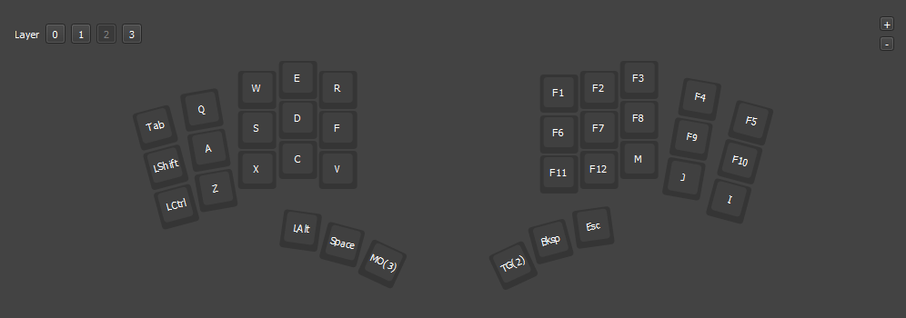

My custom [Vial ](https://get.vial.today/) configuration for the [DASBOB](https://github.com/GroooveBob/DASBOB) keyboard.

To install, in vile go to `File > Load Saved Layout` and select `Gaming.vil`.

### [Layer 0] Typing Layer (Default)

### [Layer 1] Symbol layer
This layer is acessed by holding the thumb custer key and is used for accessing symbols that are needed quickly and often while programming. They are below the gaming layer since they are not needed during gaming.

### [Layer 2] Gaming layer 
This layer is acessed from the symbol layer, the idea is that the number layer is accessed momentarily by holding the left thumb button for quick access to weapons and other MMO in game shortcuts that may be needed quickly. This means that the gaming layer sort of stays as a default layer unless you disengage it.

Disengagement is on the right side of the keyboard, which means you can only disengage if you let go of the mouse. This is to prevent accidental disengagement while gaming.

### [Layer 3] Number layer
This layer can be accessd both from the typing layer and the gaming layer, since both situations require number key access, from a standard default this layer is toggled so that sequences of numbers can be typed without interruption and less strain by not having to hold the layer key.

The gaming layer acesses this layer by holding the left thumb key, since in this situation it is used more for shortcuts and is less likely to be needed in a row.

